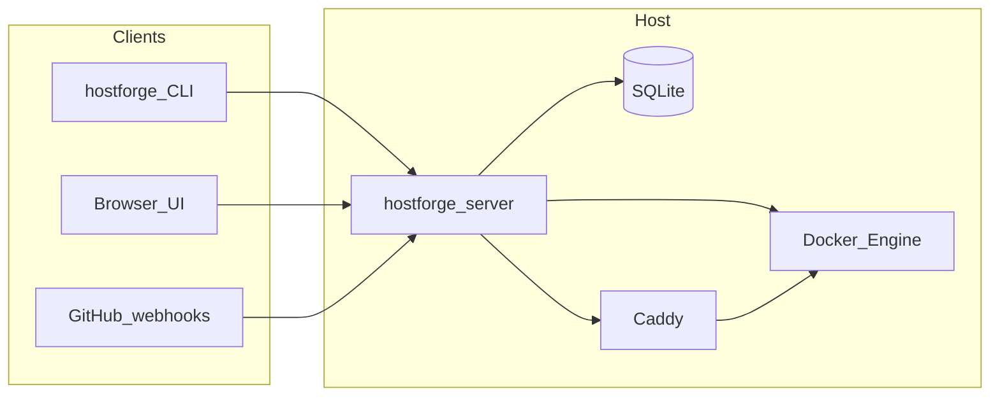

## High-level diagram

## Control plane

| Layer | Role |
|-------|------|
| **CLI** | Same deploy pipeline as the server; domain and Caddy helpers. |
| **Server** | REST + embedded static UI, GitHub `push` webhooks, WebSocket log streams, session auth. |
| **SQLite** | Projects, deployments, domains, containers, observability samples, optional encrypted project env vars. |
| **Docker** | Build images via Nixpacks, run containers with published host ports, stream runtime logs. |
| **Caddy** | HostForge writes a **generated fragment**; your **root** Caddyfile **imports** it. `caddy validate` / `caddy reload` run after changes. |

## Deploy pipeline (conceptual)

1. **Clone** repository to a deterministic worktree path (`go-git`).
2. Optionally write a **worktree-local `nixpacks.toml`** for operator defaults (e.g. Bun runtime workaround) — not committed to the user's repo.
3. **Nixpacks build** → Docker image tag `hostforge/<slug>:<build-id>`.
4. **Candidate container** on a **new host port** while the previous successful container keeps running.
5. **HTTP health** probe to `127.0.0.1:<new_port>` until success or timeout.
6. Optional **Caddy sync** so public hostnames route to the new upstream.
7. Mark deployment **SUCCESS** only after health (+ sync when required); tear down the previous container.

## Auth

- **Management API** and WebSocket streams: **`Authorization: Bearer`** matching **`HOSTFORGE_API_TOKEN`**, or a valid signed **HttpOnly session cookie** from UI login.
- **GitHub webhooks:** **`X-Hub-Signature-256`** verified with **`HOSTFORGE_WEBHOOK_SECRET`**, plus per-IP rate limiting.

## Related docs

- [Deployments and cutover](/docs/deployments-and-cutover)
- [Domains and Caddy](/docs/domains-and-caddy)
