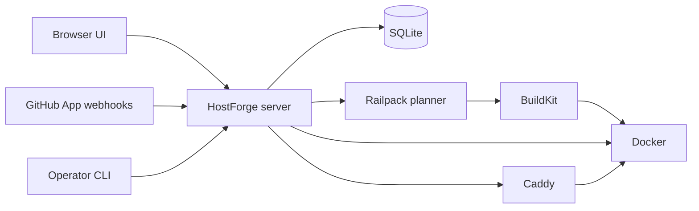

```mermaid
flowchart LR
  UI[Browser UI] --> SRV[HostForge server]
  GH[GitHub App webhooks] --> SRV
  CLI[Operator CLI] --> SRV
  SRV --> DB[(SQLite)]
  SRV --> RP[Railpack planner]
  RP --> BK[BuildKit]
  BK --> DK[Docker]
  SRV --> DK
  SRV --> CAD[Caddy]
  CAD --> DK
```

## Persistence

SQLite stores applications, environments, services, service-environment bindings, deployments, containers, domains, encrypted environment variables, platform events, host samples, service metrics, and request/deployment observability. Legacy project, PAT, SSH, and project-variable tables are removed by migration `0017`.

## Deployment pipeline

1. Resolve the service, environment binding, repository, branch, exact requested commit, and encrypted variable scope.
2. Clone/update the repository and check out the immutable commit.
3. Build from the validated service root directory.
4. Run Railpack planning with service command overrides and redacted variable placeholders.
5. Build through the digest-pinned Railpack BuildKit frontend; values enter BuildKit through temporary `0600` secret files.
6. Start a candidate Docker container on a loopback host port and inject runtime variables.
7. Pass the configured HTTP health check.
8. Set the candidate as the active service-environment release, validate/reload Caddy, and restore the previous active release if routing fails.
9. Remove the superseded container only after successful cutover.
